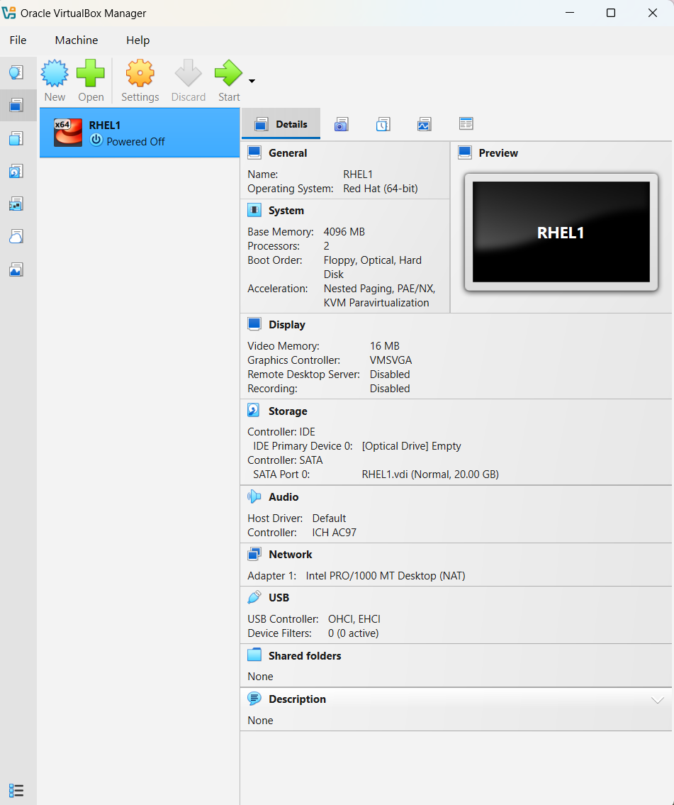
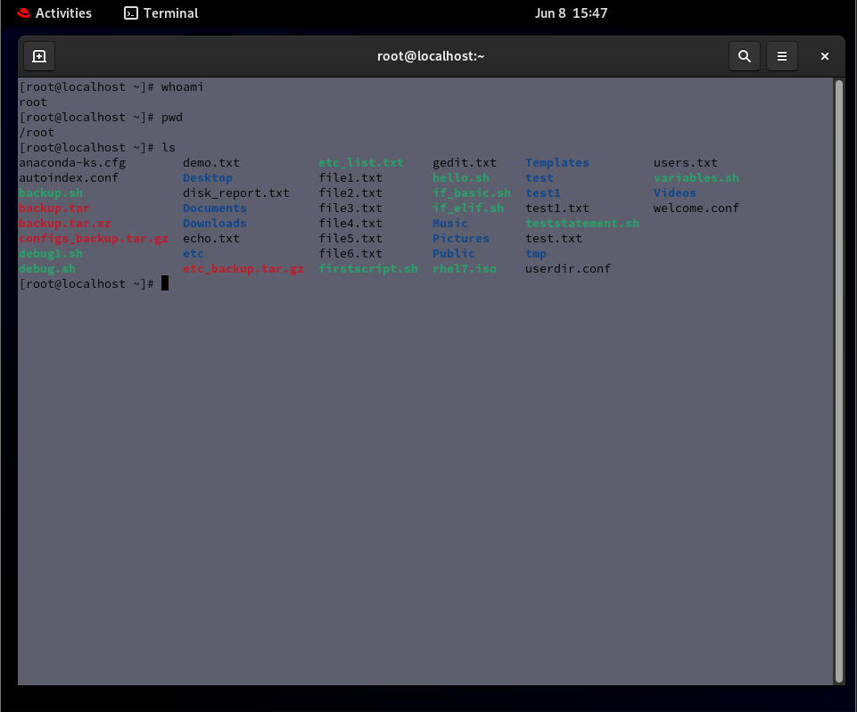

# Lab 01 - VirtualBox Environment Setup

## Objective

Create a virtualized environment using Oracle VirtualBox to support Linux administration and RHCSA practice.

## Environment

- Host Operating System: Windows
- Virtualization Platform: Oracle VirtualBox
- Guest Operating System: Red Hat Enterprise Linux testing environments

## Tasks Completed

- Installed Oracle VirtualBox
- Downloaded Linux ISO images
- Created virtual machines for Linux practice
- Configured CPU, memory, and storage allocation
- Configured virtual networking settings
- Attached ISO images to virtual machines
- Booted and tested virtual machine installations
- Troubleshot installation and boot issues

## Skills Demonstrated

- Virtualization
- Resource Allocation
- Operating System Deployment
- Virtual Networking
- System Troubleshooting
- Environment Configuration

## Challenges Encountered

- Resolved virtual machine startup issues
- Worked through ISO configuration problems
- Adjusted VirtualBox settings to support Linux installations
- Troubleshot operating system installation errors

## Reflection

This lab provided hands-on experience creating and managing a virtualized environment using VirtualBox. The experience strengthened my understanding of virtualization concepts, operating system deployment, troubleshooting, and system configuration.

## Screenshots

### VirtualBox Environment

The screenshot below shows the VirtualBox environment used to create and manage Linux virtual machines for RHCSA practice.

### Linux Terminal Access

The screenshot below shows successful access to the Linux terminal and execution of basic commands including:

whoami,
pwd,
ls.

These commands were used to verify user identity, current working directory, and file system navigation.

