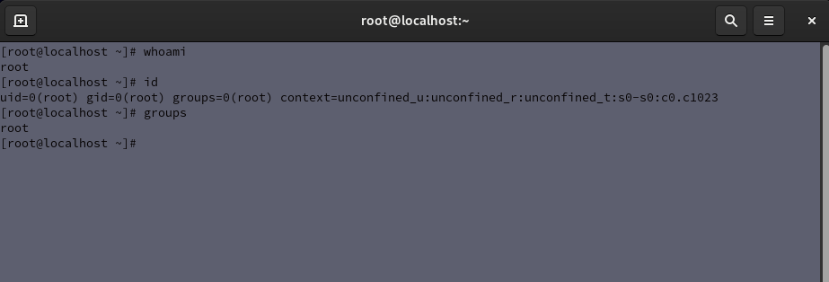
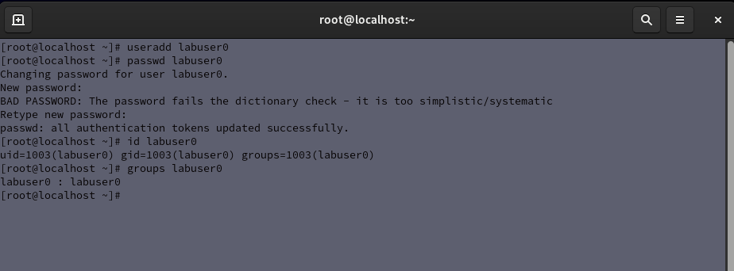

# Lab 02 - User Management

## Objective

Practice creating, modifying, and managing Linux users and groups through the command line.

## Environment

- Host Operating System: Windows
- Virtualization Platform: Oracle VirtualBox
- Guest Operating System: Red Hat Enterprise Linux

## Tasks Completed

- Viewed current user information
- Created Linux user accounts
- Modified user passwords
- Verified user account information
- Examined group memberships
- Switched between user contexts

## Commands Practiced

```bash
whoami
id
useradd
passwd
groups
su

## Screenshots

### User Information Commands

The screenshot below demonstrates user identification and group information commands.



### Creating a User Account

The screenshot below demonstrates creating a Linux user account and verifying account information.


