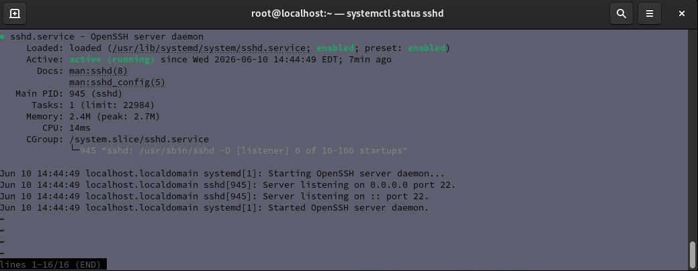
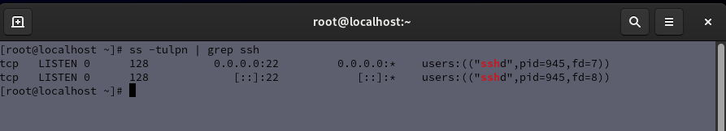
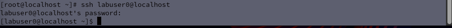

# Lab 04 - SSH Configuration

## Objective

Practice working with the Secure Shell (SSH) service used for secure remote Linux administration.

## Environment

- Host Operating System: Windows
- Virtualization Platform: Oracle VirtualBox
- Guest Operating System: Red Hat Enterprise Linux

## Tasks Completed

- Checked SSH service status
- Verified SSH was running
- Identified SSH network listening ports
- Tested SSH access locally
- Practiced basic Linux service management

## Commands Practiced

```bash
systemctl status sshd
ss -tulpn | grep ssh
ssh localhost
```

## Skills Demonstrated

- SSH Configuration
- Remote Administration
- Linux Service Management
- Network Service Verification
- Command-Line Troubleshooting
- Security Fundamentals

## Reflection

This lab introduced SSH, which is used to securely access and administer Linux systems remotely. Practicing SSH helped strengthen my understanding of Linux services, remote access, and network-based system administration.

## Screenshots

### SSH Service Status

The screenshot below demonstrates verification that the SSH service is running and available to accept incoming connections.



### SSH Listening Port Verification

The screenshot below demonstrates verification that SSH is listening on the default port (22) and is ready to accept network connections.



### Successful SSH Login

The screenshot below demonstrates a successful SSH login using the labuser0 account. This verifies that the SSH service is operational, listening on the network, accepting authentication requests, and capable of establishing remote shell sessions.


