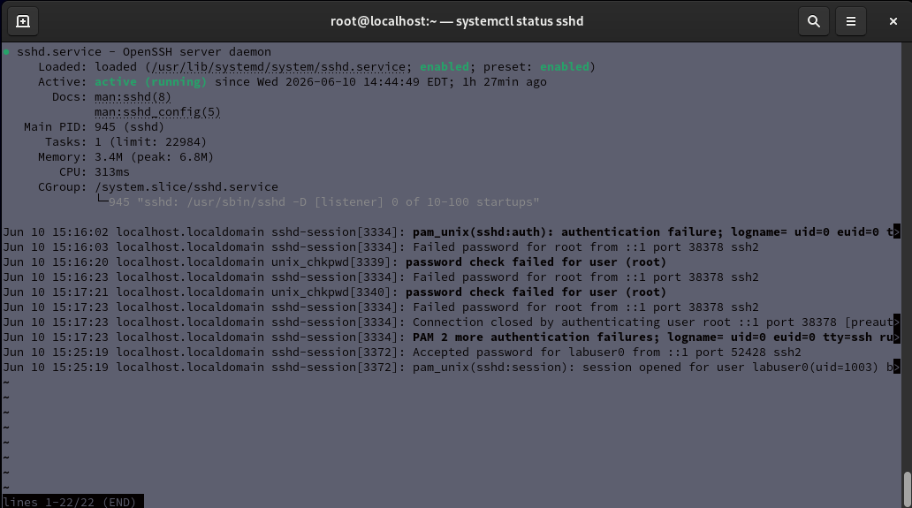
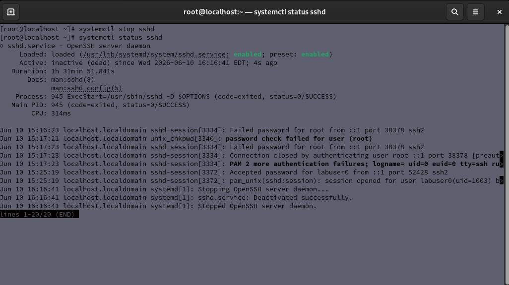
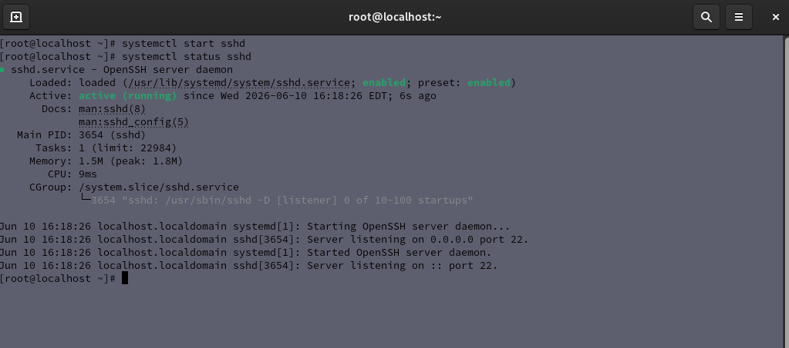

# Lab 05 - Service Management with systemctl

## Objective

Practice managing Linux services using systemctl.

## Environment

- Host Operating System: Windows
- Virtualization Platform: Oracle VirtualBox
- Guest Operating System: Red Hat Enterprise Linux

## Tasks Completed

- Checked the status of the SSH service
- Stopped the SSH service
- Verified the SSH service was inactive
- Started the SSH service again
- Verified the SSH service was active
- Checked whether SSH starts automatically at boot

## Commands Practiced

```bash
systemctl status sshd
systemctl stop sshd
systemctl start sshd
systemctl is-enabled sshd
```

## Skills Demonstrated

- Linux Service Management
- systemctl Usage
- SSH Service Control
- Troubleshooting Services
- Startup Configuration
- Command-Line Administration

## Reflection

This lab provided hands-on experience managing Linux services with systemctl. I practiced checking service status, stopping and starting services, and verifying whether a service is enabled to start automatically at boot. Understanding service management is important for Linux administration because many system functions depend on background services running correctly.

## Screenshots

### SSH Service Running

The screenshot below demonstrates checking the SSH service status using `systemctl`.



### SSH Service Stopped

The screenshot below demonstrates stopping the SSH service and verifying that it is inactive.



### SSH Service Started Again

The screenshot below demonstrates starting the SSH service again and verifying that it is active.



### SSH Service Enabled at Boot

The screenshot below demonstrates checking whether the SSH service is enabled to start automatically at boot.


