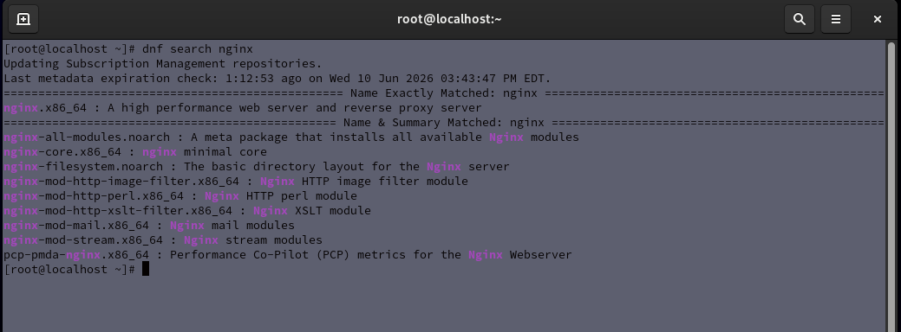
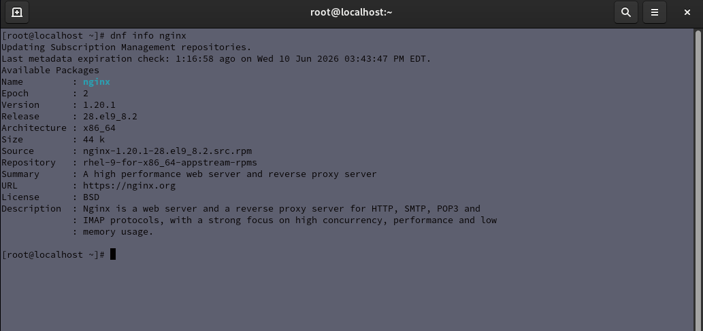
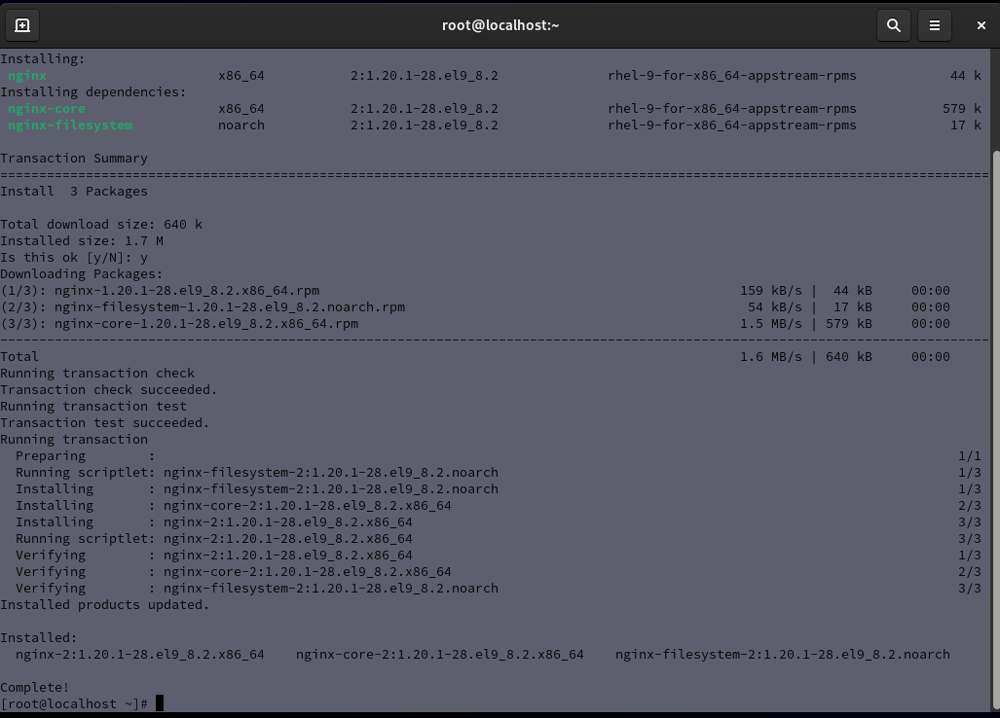
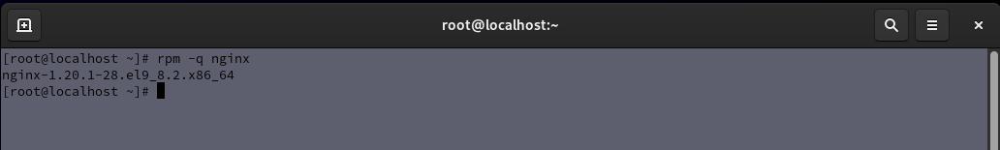
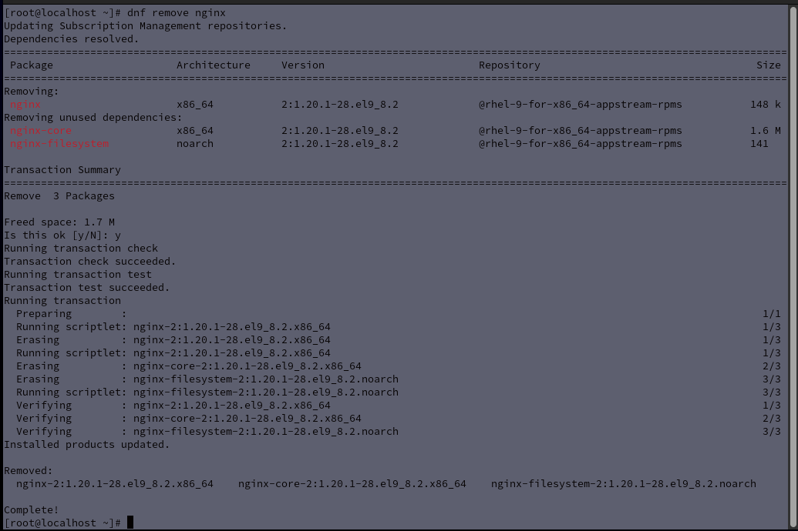

# Lab 06 - Package Management with DNF

## Objective

Practice searching for, inspecting, installing, verifying, and removing software packages using the DNF package manager.

## Environment

- Host Operating System: Windows
- Virtualization Platform: Oracle VirtualBox
- Guest Operating System: Red Hat Enterprise Linux

## Tasks Completed

- Searched for software packages
- Retrieved package information
- Installed a software package
- Verified package installation
- Removed a software package

## Commands Practiced

```bash
dnf search nginx
dnf info nginx
dnf install nginx
rpm -q nginx
dnf remove nginx
```

## Skills Demonstrated

- Package Management
- Software Installation
- Software Verification
- Linux Administration
- System Maintenance

## Reflection

This lab provided hands-on experience using DNF to manage software packages. Understanding package management is an important Linux administration skill because it is used to install, update, verify, and remove software on Linux systems.

## Screenshots

### Searching for a Package

The screenshot below demonstrates searching for the nginx package using DNF.



### Viewing Package Information

The screenshot below demonstrates viewing package details before installation.



### Installing a Package

The screenshot below demonstrates installing nginx using DNF.



### Verifying Package Installation

The screenshot below demonstrates verifying that nginx was installed using the RPM package database.



### Removing a Package

The screenshot below demonstrates removing nginx using DNF.


